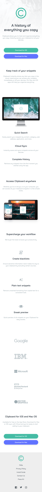

# Frontend Mentor - Clipboard landing page solution

This is a solution to the [Clipboard landing page challenge on Frontend Mentor](https://www.frontendmentor.io/challenges/clipboard-landing-page-5cc9bccd6c4c91111378ecb9). Frontend Mentor challenges help you improve your coding skills by building realistic projects. 

## Table of contents

- [Overview](#overview)
  - [The challenge](#the-challenge)
  - [Screenshot](#screenshot)
  - [Links](#links)
- [My process](#my-process)
  - [Built with](#built-with)
  - [What I learned](#what-i-learned)
  - [Useful resources](#useful-resources)


## Overview

### The challenge

Users should be able to:

- View the optimal layout for the site depending on their device's screen size
- See hover states for all interactive elements on the page

### Screenshot




### Links

- Solution URL: [https://github.com/filecc/FM-clipboard-landing-page](https://github.com/filecc/FM-clipboard-landing-page)
- Live Site URL: [https://filecc.github.io/FM-clipboard-landing-page/](https://filecc.github.io/FM-clipboard-landing-page/)

## My process

### Built with

- Semantic HTML5 markup
- CSS custom properties
- Flexbox
- CSS Grid
- Mobile and Desktop side by side workflow


### What I learned

I had some difficult trying positioning the image in the first section, so I decided to take a look at it later on. 
I worked side by side with Desktop an Mobile preview, so I was targetting everything before commit, to make sure that the elements were good enouught.
Love how I wrote +200 line of code and just 90 lines for the @media.
Sure, it can be better. 

As always the best help is this:


```css
<h1>Some HTML code I'm proud of</h1>
```
```css
.social a:hover{
    filter: invert(60%) sepia(74%) saturate(437%) hue-rotate(121deg) brightness(88%) contrast(85%);
}
```
### Useful resources

- [CSS filter for SVG](https://codepen.io/sosuke/pen/Pjoqqp) - Always so much love.

